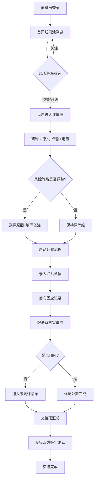

## 1. 产品概述

面向区县宣传部门值班人员的 Web 舆情预警台，专门盯控涉政敏感话题从苗头到升温的全过程，提供热点线索发现、风险分级预警、处置记录留痕三大核心能力，支持节假日和重大会议期间 7x24 小时连续值守。

- **核心目标**：在敏感舆情萌芽阶段快速发现、分级预警、闭环处置，防止事态升级扩散
- **目标用户**：区县宣传部值班员、舆情监测专员、新闻发言人
- **产品价值**：将传统人工巡检模式升级为智能线索驱动模式，响应时间缩短 80%，处置闭环率提升至 95%

---

## 2. 核心功能

### 2.1 用户角色

| 角色 | 登录方式 | 核心权限 |
|------|---------|---------|
| 值班员 | 工号登录 | 查看线索池、调整风险等级、录入处置记录 |
| 值班班长 | 工号登录 | 全部值班员权限 + 交接班汇总、导出报告 |
| 宣传部长 | 工号登录 | 查看全局统计、审批升级线索 |

### 2.2 功能模块

1. **首页（热点线索池）**：时间轴滚动线索卡片、快速筛选、风险概览仪表板、实时告警弹框
2. **线索详情页**：原文摘要、传播节点图谱、近 6 小时走势图表、风险分级调整面板
3. **处置记录页**：联系单位清单、回应发布记录、待核实事项列表、处置时间线
4. **交接班汇总页**：未闭环线索清单、本班次处置统计、交接签字确认

### 2.3 页面详情

| 页面名称 | 模块名称 | 功能描述 |
|---------|---------|---------|
| 首页 | 顶部导航栏 | 班次信息、值班员姓名、未读告警数、交接班入口 |
| 首页 | 风险概览仪表板 | 关注/预警/升级三档数量统计、24小时趋势曲线、平台分布饼图 |
| 首页 | 筛选工具栏 | 风险等级筛选、平台筛选、关键词搜索、时间范围 |
| 首页 | 线索卡片流 | 按时间倒序排列，来源平台标识、关键词标签、转发增速条、情绪倾向图标、相似帖数徽标 |
| 首页 | 实时告警弹层 | 新升级线索弹出提醒，声音+视觉双重提示 |
| 详情页 | 原文摘要卡 | 标题、发布时间、作者、原文链接、AI 摘要、原文预览展开 |
| 详情页 | 传播节点图谱 | 核心节点高亮、传播层级、关键转发路径、平台分布 |
| 详情页 | 6 小时走势图 | 转发/评论/点赞时序曲线、异常峰值标注、增速斜率对比 |
| 详情页 | 风险分级面板 | 当前等级显示、手动调整按钮、调整原因下拉（政策误读/干部言论/群体性诉求/其他）、备注输入 |
| 详情页 | 操作按钮栏 | 启动处置、标记已读、加入观察、忽略线索 |
| 处置页 | 联系单位清单 | 涉事单位选择、联系人姓名/电话、联系时间、联系结果、状态标签（已联系/待回复/无回应） |
| 处置页 | 回应发布记录 | 回应平台、发布时间、回应内容摘要、审核状态、阅读量 |
| 处置页 | 待核实事项 | 事项描述、责任人、截止时间、优先级、完成进度 |
| 处置页 | 处置时间线 | 全流程节点时间轴（发现→研判→联系→回应→核实→闭环） |
| 交接班页 | 未闭环线索清单 | 表格式展示：风险等级、关键词、首次发现时间、当前处置阶段、待办事项 |
| 交接班页 | 本班次统计 | 发现线索数、处置完成数、升级数、响应平均耗时 |
| 交接班页 | 交接签字 | 交班人/接班人签字、交接时间、备注说明、确认提交 |

---

## 3. 核心流程

值班员登录系统后，首先进入首页查看按时间滚动的线索卡片，通过仪表板快速掌握整体舆情态势。发现高风险线索后点击进入详情页，研判原文内容、传播路径和走势数据，根据实际情况调整风险等级并填写调整原因。随后启动处置流程，在处置页录入联系单位信息、发布回应记录、跟进待核实事项，所有操作自动汇总到处置时间线。交接班时系统自动提取所有未闭环线索生成本班次统计报告，交接班双方确认签字后完成交接。

---

## 4. 用户界面设计

### 4.1 设计风格

- **主色调**：深海蓝 `#0F2C4E`（权威、稳重、专业），搭配警戒橙 `#FF6B35`（预警）、危险红 `#D72638`（升级）、信息蓝 `#1B9AAA`（关注）
- **辅助色**：深灰 `#2C3E50` 用于文本，浅灰 `#F4F6F8` 用于卡片背景，金色 `#E9B44C` 用于高亮标记
- **按钮风格**：圆角 6px，主按钮采用渐变填充，次要按钮描边样式，危险按钮红底白字
- **字体选择**：标题使用「思源黑体 Bold」，正文使用「思源宋体 Regular」增强可读性，数据数字使用等宽字体「JetBrains Mono」
- **布局风格**：顶部固定导航栏 + 左侧筛选侧栏 + 主内容卡片流式布局，数据密集区采用表格+图表混排
- **图标风格**：线性图标搭配填充色标，告警类使用闪烁脉冲动画，数据卡片悬停有轻微上浮效果

### 4.2 页面设计概述

| 页面名称 | 模块名称 | UI 元素设计 |
|---------|---------|---------|
| 首页 | 顶部导航 | 深色背景（深海蓝），左侧系统名称发光标识，右侧值班信息胶囊标签，告警数红点闪烁 |
| 首页 | 风险概览 | 四张数据卡片并排：关注（蓝）、预警（橙）、升级（红）、总数（金），卡片有微妙内发光，数字大号等宽字体，底部趋势迷你图 |
| 首页 | 线索卡片流 | 两列瀑布式布局，卡片左侧垂直色条标识风险等级，右上角时间戳，关键词用彩色标签芯片，转发增速用进度条+箭头，情绪倾向用😊😐😡图标 |
| 详情页 | 布局结构 | 左右分栏 2:1，左栏：原文卡+走势图+传播图，右栏：风险面板+操作栏+快速处置入口 |
| 详情页 | 传播图谱 | 力导向关系图，中心节点大尺寸高亮，按层级向外扩散，连线粗细表示传播量，颜色区分平台 |
| 详情页 | 走势图表 | 面积图样式，三条曲线叠加（转发=红/评论=蓝/点赞=绿），峰值处红色圆点标注，鼠标悬浮显示精确数值 |
| 处置页 | 时间线 | 左侧垂直时间轴，圆点节点颜色对应状态，右侧事件卡片，时间刻度精确到分钟 |
| 处置页 | 表单区 | 三栏独立卡片式表单，每组有独立标题+操作按钮，已完成项灰显加删除线 |
| 交接班页 | 汇总表 | 斑马纹表格，行首风险色条，未闭环行背景微浅红，悬停高亮整行，底部浮动签字确认栏 |

### 4.3 响应式设计

- **桌面端优先**：核心布局面向 1920x1080 及以上分辨率设计，保证数据密度和可视区域
- **平板适配**：1024px 断点下线索卡片改为单列布局，筛选侧栏折叠为顶部标签式
- **触屏优化**：操作按钮最小 44x44px，重要操作二次确认弹窗防止误触，长列表支持惯性滚动
- **打印支持**：交接班汇总页提供打印样式，自动隐藏导航和交互元素，仅保留核心数据表格

### 4.4 交互动效

- **页面加载**：卡片依次从下方滑入，错开 80ms 延迟，营造数据流涌动感
- **告警提示**：升级线索卡片边框脉冲红光动画，顶部导航告警数红点呼吸闪烁
- **卡片悬停**：Y 轴上浮 4px + 阴影扩散 8px，风险色条宽度从 4px 扩展到 6px
- **数据更新**：数字变化时滚动翻牌动画，走势图数据点增量滑入
- **风险调整**：等级标签切换时 360° 旋转并变色，持续 0.4s
