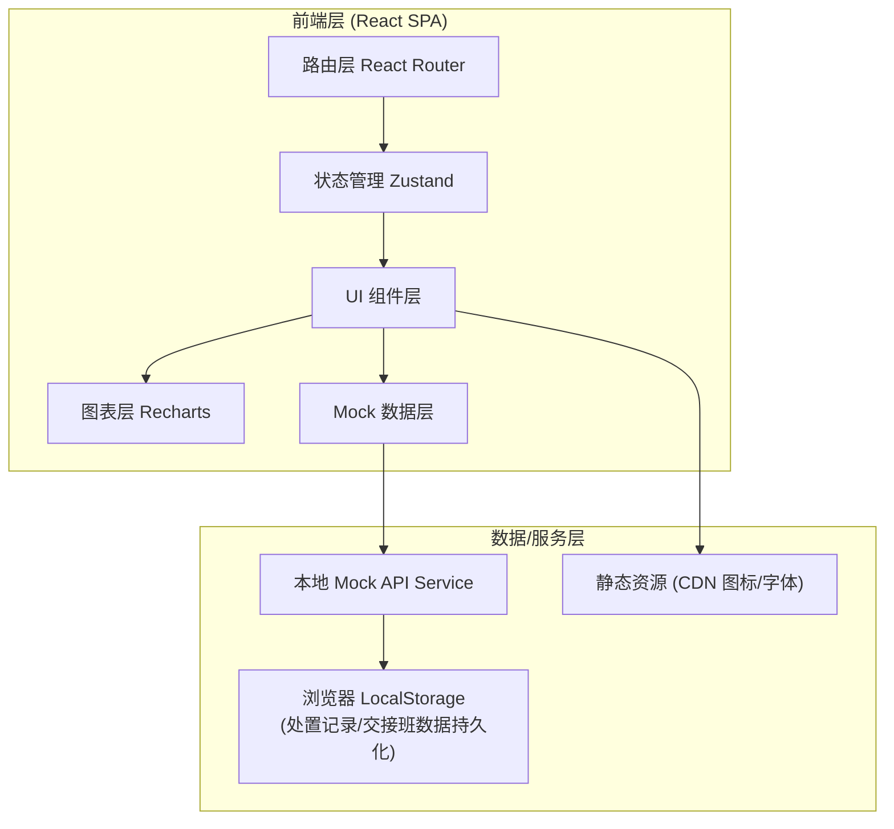
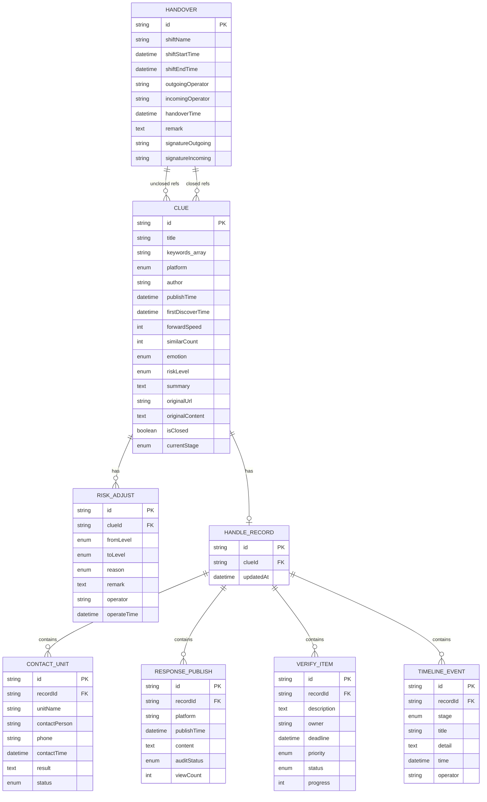

## 1. 架构设计



---

## 2. 技术说明

- **前端框架**：React@18 + TypeScript（类型安全，适合数据密集型管理后台）
- **初始化工具**：Vite@5（极速冷启动，HMR 毫秒级）
- **样式方案**：TailwindCSS@3 + CSS Variables（设计 token 统一管理，快速构建界面）
- **路由管理**：React Router DOM@6（嵌套路由支持，详情页/处置页参数传递）
- **状态管理**：Zustand（轻量级，无需 Provider 包裹，适合中型应用）
- **图表库**：Recharts（React 原生，走势图/饼图/柱状图开箱即用）
- **图标库**：Lucide React（线性图标，风格统一轻量）
- **后端**：无后端，全部使用 Mock 数据 + LocalStorage 模拟持久化
- **数据库**：LocalStorage 作为持久化存储，页面刷新不丢失处置记录

---

## 3. 路由定义

| 路由路径 | 页面组件 | 用途说明 |
|---------|---------|---------|
| `/` | `DashboardPage` | 首页：风险概览 + 线索池卡片流 + 筛选工具 |
| `/clue/:id` | `ClueDetailPage` | 线索详情：原文摘要 + 传播图谱 + 6 小时走势 + 风险调整 |
| `/clue/:id/handle` | `HandleRecordPage` | 处置记录：联系单位 + 回应发布 + 待核实 + 时间线 |
| `/handover` | `HandoverPage` | 交接班汇总：未闭环清单 + 班次统计 + 交接签字 |
| `*` | `NotFoundPage` | 404 页面：友好提示 + 返回首页链接 |

---

## 4. API 定义（Mock 接口层）

```typescript
// ============ 类型定义 ============

export type RiskLevel = 'watch' | 'warn' | 'escalate';

export type EmotionType = 'positive' | 'neutral' | 'negative';

export type PlatformType = 'weibo' | 'wechat' | 'douyin' | 'tieba' | 'zhihu' | 'news';

export type AdjustReason = 
  | 'policy_misread'    // 政策误读
  | 'official_speech'   // 干部言论
  | 'collective_demand' // 群体性诉求
  | 'rumor_spread'      // 谣言传播
  | 'media_report'      // 媒体报道
  | 'other';            // 其他

export type ContactStatus = 'contacted' | 'pending_reply' | 'no_response';

export type VerifyStatus = 'pending' | 'in_progress' | 'done';

export type DisposeStage = 'found' | 'analyze' | 'contact' | 'respond' | 'verify' | 'closed';

// ============ 线索数据模型 ============

export interface Clue {
  id: string;
  title: string;
  keywords: string[];
  platform: PlatformType;
  author: string;
  publishTime: string;      // ISO timestamp
  firstDiscoverTime: string;
  forwardSpeed: number;     // 转发增速 条/小时
  similarCount: number;     // 相似帖数量
  emotion: EmotionType;
  riskLevel: RiskLevel;
  riskAdjustHistory?: RiskAdjustRecord[];
  summary: string;
  originalUrl: string;
  originalContent: string;
  trend: TrendPoint[];      // 近 6 小时走势
  spreadNodes: SpreadNode[];
  isClosed: boolean;
  currentStage: DisposeStage;
}

export interface TrendPoint {
  time: string;             // HH:mm
  forwards: number;
  comments: number;
  likes: number;
}

export interface SpreadNode {
  id: string;
  platform: PlatformType;
  author: string;
  followerCount: number;
  forwardCount: number;
  isKeyNode: boolean;
  level: number;            // 传播层级 1-N
}

export interface RiskAdjustRecord {
  id: string;
  clueId: string;
  fromLevel: RiskLevel;
  toLevel: RiskLevel;
  reason: AdjustReason;
  remark: string;
  operator: string;
  operateTime: string;
}

// ============ 处置记录模型 ============

export interface HandleRecord {
  id: string;
  clueId: string;
  contactUnits: ContactUnit[];
  responses: ResponsePublish[];
  verifyItems: VerifyItem[];
  timeline: TimelineEvent[];
  updatedAt: string;
}

export interface ContactUnit {
  id: string;
  unitName: string;
  contactPerson: string;
  phone: string;
  contactTime: string;
  result: string;
  status: ContactStatus;
}

export interface ResponsePublish {
  id: string;
  platform: string;
  publishTime: string;
  content: string;
  auditStatus: 'draft' | 'approved' | 'published';
  viewCount: number;
}

export interface VerifyItem {
  id: string;
  description: string;
  owner: string;
  deadline: string;
  priority: 'high' | 'medium' | 'low';
  status: VerifyStatus;
  progress: number;        // 0-100
}

export interface TimelineEvent {
  id: string;
  stage: DisposeStage;
  title: string;
  detail: string;
  time: string;
  operator: string;
}

// ============ 交接班模型 ============

export interface HandoverRecord {
  id: string;
  shiftName: string;         // e.g. "早班"
  shiftStartTime: string;
  shiftEndTime: string;
  outgoingOperator: string;
  incomingOperator: string;
  handoverTime: string;
  closedClueIds: string[];
  unclosedClueIds: string[];
  statistics: ShiftStatistics;
  remark: string;
  signatureOutgoing: string; // 模拟签字
  signatureIncoming: string;
}

export interface ShiftStatistics {
  totalFound: number;
  totalDisposed: number;
  totalEscalated: number;
  avgResponseMinutes: number;
  platformBreakdown: Record<PlatformType, number>;
}

// ============ Mock API 函数签名 ============

export interface PublicSentimentApi {
  // 线索相关
  getClueList(filters?: {
    riskLevel?: RiskLevel;
    platform?: PlatformType;
    keyword?: string;
    timeRange?: [string, string];
  }): Promise<Clue[]>;

  getClueById(id: string): Promise<Clue | null>;

  adjustRiskLevel(
    clueId: string,
    toLevel: RiskLevel,
    reason: AdjustReason,
    remark: string
  ): Promise<RiskAdjustRecord>;

  updateClueStage(clueId: string, stage: DisposeStage): Promise<void>;

  closeClue(clueId: string): Promise<void>;

  // 处置记录相关
  getHandleRecord(clueId: string): Promise<HandleRecord | null>;

  saveHandleRecord(record: HandleRecord): Promise<void>;

  // 交接班相关
  getUnclosedClues(): Promise<Clue[]>;

  createHandover(record: HandoverRecord): Promise<void>;

  getRecentHandovers(limit?: number): Promise<HandoverRecord[]>;

  // 统计概览
  getDashboardStats(): Promise<{
    watchCount: number;
    warnCount: number;
    escalateCount: number;
    totalCount: number;
    trend24h: { hour: string; count: number }[];
    platformDistribution: Record<PlatformType, number>;
  }>;
}
```

---

## 5. 数据模型 ER 图



---

## 6. 项目目录结构

```
src/
├── assets/                 # 静态资源
│   └── fonts/             # 自定义字体
├── components/            # 通用组件
│   ├── layout/           # 布局组件（导航、侧边栏、页脚）
│   ├── ClueCard.tsx      # 线索卡片
│   ├── RiskBadge.tsx     # 风险等级徽章
│   ├── EmotionIcon.tsx   # 情绪倾向图标
│   ├── PlatformLogo.tsx  # 平台标识
│   ├── TrendChart.tsx    # 6 小时走势图
│   ├── SpreadGraph.tsx   # 传播节点图谱
│   ├── Timeline.tsx      # 处置时间线
│   └── StatCard.tsx      # 统计数据卡片
├── pages/                 # 页面组件
│   ├── DashboardPage.tsx
│   ├── ClueDetailPage.tsx
│   ├── HandleRecordPage.tsx
│   ├── HandoverPage.tsx
│   └── NotFoundPage.tsx
├── store/                 # Zustand 状态管理
│   ├── clueStore.ts
│   ├── handleStore.ts
│   └── handoverStore.ts
├── mock/                  # Mock 数据
│   ├── clueData.ts
│   ├── handleData.ts
│   ├── handoverData.ts
│   └── api.ts            # Mock API 实现
├── types/                 # TypeScript 类型
│   └── index.ts
├── utils/                 # 工具函数
│   ├── time.ts           # 时间格式化
│   ├── format.ts         # 数字格式化
│   └── storage.ts        # LocalStorage 封装
├── styles/                # 全局样式
│   └── globals.css       # Tailwind 指令 + 自定义样式
├── App.tsx               # 根组件 + 路由
├── main.tsx              # 入口文件
└── vite-env.d.ts
```
